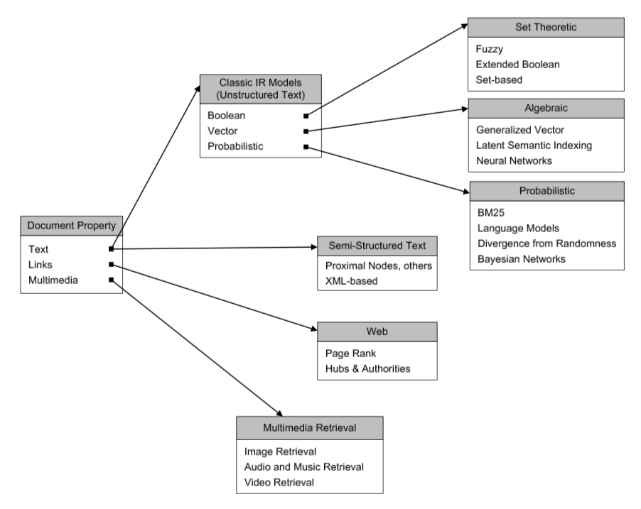
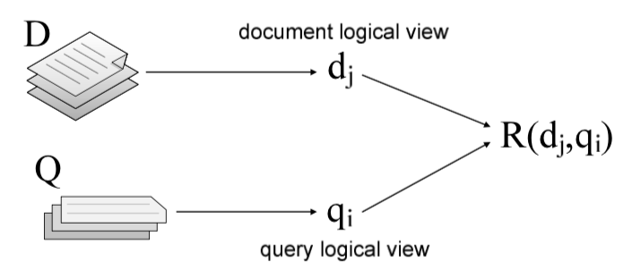
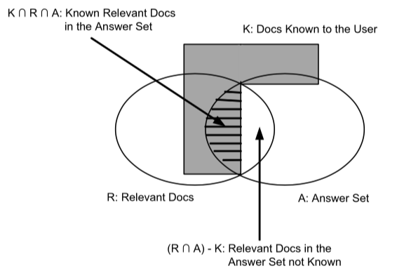

# Information Retrieval - Topic Modelling Relevent Part

* [Wiki - Information Retrieval](https://en.wikipedia.org/wiki/Information_retrieval)
* [Gensim - Introduction (Concepts)](https://radimrehurek.com/gensim/intro.html)
* [Gensim - Tutorial (example about TF-IDF)](https://radimrehurek.com/gensim/tutorial.html)

## Overview

### [Information Retrieval Model](#IR-Models)

Four characters in Information Retrieval Model

* $D$: Documents
* $Q$: Query
* $F$: Framework (i.e. chosen Model)
* $R(q_i, d_j)$: Ordering (Ranking) funciton

$$
\text{Information Retreival Model} = [D, Q, F, R(q_i, d_j)]
$$

Relevant Searching

$$
\text{Relevant} = f(Q, d_j, D)
$$

#### Classical Information Retrieval Model

(usually work with unstructured text document)

**Set-theoretic Models**:

Set-theoretic models represent documents as sets of words or phrases. Similarities are usually derived from set-theoretic operations on those sets.

* [Boolean Model](#Boolean-Model)
* [Fuzzy Set Model](#Fuzzy-Set-Model)
* [Extended Boolean Model](#Extended-Boolean-Model)

**Algebraic Models**:

Algebraic models represent documents and queries usually as vectors, matrices, or tuples. The similarity of the query vector and document vector is represented as a scalar value.

* [Vector Space Model](#Vector-Space-Model)
* [Extended Boolean Model](#Extended-Boolean-Model)
* [Generalized Vector Space Model](#Generalized-Vector-Space-Model)
* (Enhanced) Topic-based Vector Space Model
* [Latent Semantic Indexing (LSI) aka. Latent Semantic Analysis (LSA)](#Latent-Semantic-Analysis-(Latent-Semantic-Indexing)) (潛在語意分析)

**Probabilistic Models**:

Probabilistic models treat the process of document retrieval as a probabilistic inference. Similarities are computed as probabilities that a document is relevant for a given query. Probabilistic theorems like the Bayes' theorem are often used in these models.

* Binary Independence Model
* Probabilistic Relevance Model (on which is based the okapi (BM25) relevance function)
* Uncertain Inference
* Language Models
* Divergence-from-randomness Model
* Latent Dirichlet Allocation

#### Semi-structured Document Information Retrieval Model

* XML

#### [Link-based Information Retrieval Model](#Link-Analysis)

* [Page Rank](#Page-Rank) - By Google
* [HITS](#HITS-(Hypertext-Induced-Topic-Search)) - By IBM
    * Hubs & Authorities

#### Multimedia Information Retrieval Model

* Image
* Audio and Music
* Video

### [How to represent text](#Text-Representation)

* [Bag-of-words approach](#Bag-of-words-Approach)
* [Vector representation](#Vector-Representation)

### [Term Weight](#Term-Weighting)

* [TF-IDF](#TF-IDF)

### [Performance and Correctness Measures](#Evaluation-Measures)

* [Set-Based Measures](#Set-Based-Measures)
    * Precision
    * Recall
    * Fall-out
    * Miss
    * F-score / F-measure
    * Average precision
    * R-Precision
    * Mean average precision
* [User-Oriented Measures](#User-Oriented-Measures)
    * coverage ratio
    * novelty ratio
    * relative recall
    * recall effort
* [Discounted Cumulative Gain](#Discounted-Cumulative-Gain-(DCG))
    * nDCG
* Others
    * A/B testing

### [The Document Collections](#Document-Collections)

* Pooling Method

Standard Relevance Benchmarks

* The TREC Web Collections
* INEX
* Reuters, OHSUMED, NewsGroups
* NTCIR
* CLEF
* GOV2

---

## Text Representation

### Bag-of-words Approach

[Wiki - Bag-of-words model](https://en.wikipedia.org/wiki/Bag-of-words_model)

* Treat all the words in a document as *index terms* for that document
* Assign a *weight* to each term based on its *importance*
* *Disregard order, structure, meaning, etc.* of the words

Conclusion

* This approach think IR is all (and only) about mathcing words in documents with words in queries (which is not true)
* But it works pretty well

#### Vector Representation

- [Wiki - Word2vec](https://en.wikipedia.org/wiki/Word2vec)
- [Tensorflow - Vector Representations of Words](https://www.tensorflow.org/tutorials/representation/word2vec)

* "Bags of words" can be represented as vectors
    * For computational efficiency, easy of manipulation
    * Geometric metaphor: "arrows"
* A vector is a set of values recorded in any consistent order

## Term Weighting

**Term**:

The definition of **term** depends on the application. (Typically terms are single words, keywords, or longer phrases.)

* Each dimension corresponds to a separate term.
* If a term occurs in the document, its value in the vector is non-zero.
* If words are chosen to be the terms, the dimensionality of the vector is the number of words in the vocabulary (the number of distinct words occurring in the corpus).

**Example**:

document|text                       |terms
--------|---------------------------|-------------------
doc1    |ant ant bee                |ant bee
doc2    |dog bee dog hog dog ant dog|ant bee dog hog
doc3    |cat gnu dog eel fox        |cat dog eel fox gnu

query|content
-----|-------
q    |ant dog

**Term incidence matrix (in Term vector space (No weighting))**:

doc |ant|bee|cat|dog|eel|fox|gnu|hog
----|:-:|:-:|:-:|:-:|:-:|:-:|:-:|:-:
doc1| 1 | 1 |   |   |   |   |   |
doc2| 1 | 1 |   | 1 |   |   |   | 1
doc3|   |   | 1 | 1 | 1 | 1 | 1 |

**Unnormalized Form of Term Frequency (TF) (weighting)**:

(Weight of term td) = frequency that term j occurs in document i

doc |ant|bee|cat|dog|eel|fox|gnu|hog|length
----|:-:|:-:|:-:|:-:|:-:|:-:|:-:|:-:|-----:
doc1| 2 | 1 |   |   |   |   |   |   |$\sqrt{5}$
doc2| 1 | 1 |   | 4 |   |   |   | 1 |$\sqrt{19}$
doc3|   |   | 1 | 1 | 1 | 1 | 1 |   |$\sqrt{5}$

Calculate Ranking:

Similarity of documents

-   |doc1|doc2|doc3
----|:--:|:--:|:--:
doc1| 1  |0.31| 0
doc2|0.31| 1  |0.41
doc3| 0  |0.41| 1

Similarity of query to documents

-   |doc1|doc2|doc3
----|:--:|:--:|:--:
q   |0.63|0.81|0.32

**Methods for Selecting Weights**:

* Empirical

    Test a large number of possible weighting schemes with actual data

* Model based

    Develoop a mathematical model of word distribution and derive weighting scheme theoretically. (e.g Probabilistic model)

* Intuition
    * Terms that appear often in a document should get higher weights
        * The more often a document contains the term "dog", the more likely that the document is "about" dogs
    * Terms that appear in many documents should get low weights
        * Words like "the", "a", "of" appear in (nearly) all documents

* Weighting scheme
    * bianry (i.e. term incidence matrix)
    * row count (i.e. unnormalized form of term frequency)
    * term frequency (the following thing...)
    * log normalization
    * double normalization 0.5
    * double normalization K
    * ...

### TF-IDF

- [Wiki - TF-IDF](https://en.wikipedia.org/wiki/Tf%E2%80%93idf)

* TF stands for Term Frequency
* IDF stands for Inverse Document Frequency

#### Term Frequency

($t$ stands for term; $d$ stands for document)

$$
tf(t, d) = f_{t, d}
$$

**Concept**:

* A term that appears many times within a document is likely to be more important than a term that appears only once

**Normalization** (for Free-text document):

Key: Length of document

* a term frequency in different length of document may have different importance

Maximum Normalization:

$$
tf(t, d)  = \frac{f_{t, d}}{\text{maximum frequency of any term in document}_d}= \frac{f_{t, d}}{\max_{t' \in d}(f_{t, d})} = \frac{f_{t, d}}{m_d}
$$

Augmented Maximum Normalization: (for Structured Text)

(Salton and Buckley recommend K = 0.5)

$$
tf(t, d) = K + (1-K) \times \frac{f_{t, d}}{m_d}, K \in [0, 1]
$$

Cosine Normalization:

$$
tf(t, d) = \frac{f_{t, d}}{\sqrt{\sum_{d}(f_{t, d})^2}}
$$

#### Inverse Document Frequency

**Concept**:

* A term that occurs in only a few documents is likely to be a better discriminator that a term that appears in most or all documents

**A Simple Method**: use document frequency

$$
idf(t, D) = \frac{1}{df} = \frac{1}{\frac{\text{number of document has term}_j}{\text{number of total documents}}} = \frac{|D|}{n_t}
$$

(the simple method over-emphasizes small differences) => use logarithm

**A Standard Method**: use log form

$$
idf(t, D) = \log(\frac{N}{n_t}) + 1
$$

#### Full weighting of TF-IDF

The weight assigned to term $t$ in document $d$:

$$
\mathit{tf.idf}(t, d, D) = tf(t, d) \times idf(t, D)
$$

Example:

$$
\mathit{tf.idf}(t, d, D) = \underbrace{\frac{f_{t, d}}{m_t}}_{tf(t, d)} \times \underbrace{(\log(\frac{N}{n_t}) + 1)}_{idf(t, D)}
$$

## IR Models

### Boolean Model

* [Wiki - Boolean model of information retrieval](https://en.wikipedia.org/wiki/Boolean_model_of_information_retrieval)
* [Wiki - DNF (Disjunctive normal form)](https://en.wikipedia.org/wiki/Disjunctive_normal_form)

**Brief description**:

* Based on notion of sets
* Documents are retrieved *only if* they satisfy boolean conditions specified in the query
* *No ranking* on retrieved documents (can't have order)
* *Exact match* (don't support fuzzy match)

**Similarity of documnet and query**:

$$
\mathit{Sim}(\mathbf{doc}_i, \mathbf{query})
\begin{cases}
1, \exists c(\mathbf{query})|c(\mathbf{query}) = c(\mathbf{doc}_i) \\
0, \text{otherwise}
\end{cases}
$$

#### Boolean Retreival

(Boolean operators *approximate* natural language)

* AND: discover relationships between concepts
* OR: discover alternate terminology
* NOT: discover alternate meaning

The Perfect Query Paradox

* Every information need has a perfect set of documents
    * If not, there would be no sense doing retrieval
* Every document set has a perfect query
    * AND every word in a document to get a query for it
    * Repeat for each document in the set
    * OR every document query to get the set query
> but can users realistically be expected to formulate this perfect query?
> => perfact query formulation is hard

Why Boolean Retrieval Fails

* Natural language is way more complex
* AND "discovers" nonexistent relationships
    * Terms in different sentences, paragraphs, ...
* Guessing terminology for OR is hard
    * e.g. good, nice, excellent, outstanding, awesome, ...
* Guessing terms to exclude is even harder
    * e.g. democratic party, party to a lawsuit, ...

Pros and Cons

* Strengths
    * Precise
        * if you know the right strategies
        * if you have an idea of what you're looking for
    * Efficient for the computer
* Weaknesses
    * User must learn boolean logic
    * Boolean logic insufficient to capture the richness of language
    * No control over size of result set (either too many documents or none)
    * When do you stop reading? All documents in the result set are considered "equally good"
    * What about partial matches? Documents that "don't quite match" the query may be useful also

#### Ranked Retrieval

Arranging documents by relevance

* Closer to how humans think
    * some documents are "better" than others
* Closer to user behavior
    * users can decide when to stop reading
* Best (partial) match
    * documents need not have all query terms

Similarity-Based Queries

* Replace *relevance* with *similarity*
    * rank documents by their similarity with the query
* Treat the query as if it were a document
    * Create a query bag-of-words
    * Find its similarity to each document
    * Rank by sorting the document with similarity

### Vector Space Model

* [Wiki - Vector space model](https://en.wikipedia.org/wiki/Vector_space_model)

**Brief description**:

* Based on geometry, the notion of *vectors in high dimensional space*
* Documents are *ranked* based on their similarity to the query (ranked retrieval)
* *Best / partial match*

> Postulate: Documents that are "close together" in vector space "talk about" the same things

Therefore, retrieve documents based on how close the document is to the query (i.e. similarity ~ "closeness")

**Similarity of document and query**:

* [Wiki - Cosine similarity](https://en.wikipedia.org/wiki/Cosine_similarity)

$$
\mathit{Sim}(\mathbf{doc}_i, \mathbf{query}) = \cos{\theta} = \frac{\mathbf{doc}_i \cdot \mathbf{query}}{\left\| \mathbf{doc}_i \right\| \left \| \mathbf{query} \right\|}
$$

### Fuzzy Set Model

* [Wiki - Fuzzy retrieval](https://en.wikipedia.org/wiki/Fuzzy_retrieval)
* [Wiki - Fuzzy set](https://en.wikipedia.org/wiki/Fuzzy_set)

**Fuzzy Set**:

Operations

* NOT ${\displaystyle \forall x\in {U}:\mu _{\neg {A}}(x)=1-\mu _{A}(x)}$
* AND ${\displaystyle \forall x\in {U}:\mu _{A\cap {B}}(x)=t(\mu _{A}(x),\mu _{B}(x))}$
* OR ${\displaystyle \forall x\in {U}:\mu _{A\cup {B}}(x)=s(\mu _{A}(x),\mu _{B}(x))}$

### Extended Boolean Model

* [Wiki - Extended Boolean model](https://en.wikipedia.org/wiki/Extended_Boolean_model)

The weight of term Kx associated with document dj is measured by its normalized Term frequency

${\displaystyle w_{x,j}=f_{x,j}*{\frac {Idf_{x}}{max_{i}Idf_{i}}}}$

* **P-norms** ($L^\textit{p}\text{-norm}$): extends the notion of distance to include p-distances, where 1 ≤ p ≤ ∞ is a new parameter
    * p = 1, similarity like vector space model
    * p = ∞, similarity like fuzzy set model

Euclidean distances similarity

${\displaystyle q_{or}=k_{1}\lor ^{p}k_{2}\lor ^{p}....\lor ^{p}k_{t}}$

$$
{\displaystyle sim(q_{or},d_{j})={\sqrt[{p}]{\frac {w_{1}^{p}+w_{2}^{p}+....+w_{t}^{p}}{t}}}}
$$

${\displaystyle q_{and}=k_{1}\land ^{p}k_{2}\land ^{p}....\land ^{p}k_{t}}$

$$
{\displaystyle sim(q_{and},d_{j})=1-{\sqrt[{p}]{\frac {(1-w_{1})^{p}+(1-w_{2})^{p}+....+(1-w_{t})^{p}}{t}}}}
$$

Summary

* Include boolean, vector space, fuzzy set in one model (framework)

### Generalized Vector Space Model

* [Wiki - Generalized vector space model](https://en.wikipedia.org/wiki/Generalized_vector_space_model)

Similarity

$$
{\displaystyle sim(d_{k},q)={\frac {\sum _{j=1}^{n}\sum _{i=1}^{n}w_{i,k}\times wgma_{j,q}\times t_{i}\cdot t_{j}}{{\sqrt {\sum _{i=1}^{n}w_{i,k}^{2}}}\times {\sqrt {\sum _{i=1}^{n}w_{i,q}^{2}}}}}}
$$

### Latent Semantic Analysis (Latent Semantic Indexing)

* [Wiki - Latent Semantic Analysis](https://en.wikipedia.org/wiki/Latent_semantic_analysis)

Dimensionality reduction using **truncated SVD** (aka LSA)

In particular, truncated SVD works on *term count/tf-idf* matrices. In that context, it is known as latent semantic analysis (LSA).

This estimator supports two algorithms: a fast randomized SVD solver, and a “naive” algorithm that uses ARPACK as an eigensolver on (X * X.T) or (X.T * X), whichever is more efficient.

**Doc-Term Matrix** (like User-Item Rating Matrix in Recommendation System)

Ranked similarity by TF-IDF

## Evaluation Measures

[Wiki - Evaluation measures (information retrieval)](https://en.wikipedia.org/wiki/Evaluation_measures_(information_retrieval))

What IR evaluate for?

* Efficiency
    * retrieval time
    * indexing time
    * index size
* Effectiveness
    * how "good" are the documents that are returned?
    * system only / human + system
* Usability
    * learnability
    * frustration
    * novice vs. expert users
* Others
    * coverage
    * update frequency
    * visit rate
    * ...

**Test collection**: a laboratory environment that doesn’t
change

* determine how well IR systems perform
* compare the performance of the IR system with that of other systems
* compare search alghoritms and strategies with each other
> **The Cranfield Paradigm**: provided a foundation for the
evaluation of IR systems => Precision ration and Recall ratio

### Set-Based Measures

Actual \ Redicted   |Relevant           |Not relevant
:------------------:|:-----------------:|:-----------------:
**Retrieved**       |True Positive (TP) |False Negative (FN)
**Not Retrieved**   |False Positive (FP)|True Negative (TN)

- $R$ (Relevant documents) = $TP + FP$
- $A$ (Answer) = $TP + FN$ (documents which we thought to be the answer)
- Collection size = $TP + FP$ + $FP$ + $TN$ = $R\cup A$

#### Precision

$\displaystyle\text{Precision} = \frac{TP}{(TP + FP)} = \frac{|R\cap A|}{|A|}$

* the fraction of documents retrieved that are relevant

#### Recall

$\displaystyle\text{Recall} = \frac{TP}{(TP + FN)} = \frac{|R\cap A|}{|R|}$

* the fraction of relevant documents retrieved
* hard to compute (need to know all the relevant document) => [Pooling Method](#Pooling-Method)

**Miss** = $\displaystyle\frac{FN}{(TP + FN)}$

* the inverse of precision

**False alarm (fallout)** = $\displaystyle\frac{FP}{(FP + TN)}$

### Single Value Summaries

#### P@n

Precision at n

* P@5, n = 5
* P@10, n = 10
* P@20, n = 20

- Consider user usually only care the first page (or the top n) search result

#### R-Precision

#### MAP (Mean Average Precision)

**Precision-Recall Curve**

TBD

**AP**

* The idea here is to average the precision figures obtained after each new relevant document is observed
    * For each query, we calculate precision for each recall
    * Each time we found a new relevent document => get a new recall
        * Precision = # of Relevent / Current found documents
    * For relevant documents not retrieved, the precision is set to 0
    * Invoke average at the end
* Interpolation
    * Fill the recall to 10% 20% ... 100% base

**MAP**

Mean of every query's AP

$$
 \operatorname{MAP} = \frac{\sum_{q=1}^Q \operatorname{AveP(q)}}{Q} \!
$$

* System comparison

#### MRR (Mean Reciproach Rank)

* [Wiki - Mean reciprocal rank](https://en.wikipedia.org/wiki/Mean_reciprocal_rank)
* [Wiki - Question Answering (QA)](https://en.wikipedia.org/wiki/Question_answering)

$$
{\text{MRR}}={\frac  {1}{|Q|}}\sum _{{i=1}}^{{|Q|}}{\frac  {1}{{\text{rank}}_{i}}}
$$

#### F Measure: Harmonic means of Precision and Recall

[Wiki - F1 score](https://en.wikipedia.org/wiki/F1_score)

The traditional F-measure or balanced F-score (F1 score) is the [harmonic mean](https://en.wikipedia.org/wiki/Harmonic_mean#Harmonic_mean_of_two_numbers) of precision and recall

$$
{\displaystyle F_{1}=\left({\frac {\mathrm {recall} ^{-1}+\mathrm {precision} ^{-1}}{2}}\right)^{-1}=2\cdot {\frac {\mathrm {precision} \cdot \mathrm {recall} }{\mathrm {precision} +\mathrm {recall} }}}
= \frac{2}{\frac{1}{P} + \frac{1}{R}}
$$

The general formula for positive real β

$$
F_\beta = (1 + \beta^2) \cdot \frac{\mathrm{precision} \cdot \mathrm{recall}}{(\beta^2 \cdot \mathrm{precision}) + \mathrm{recall}}
$$

#### E Measure

$$
{\displaystyle E=1-\left({\frac {\alpha }{p}}+{\frac {1-\alpha }{r}}\right)^{-1}}
$$

Their relationship is $F_{\beta }=1-E$ where ${\displaystyle \alpha ={\frac {1}{1+\beta ^{2}}}}$

### User-Oriented Measures

#### Coverage Ratio

$$
\operatorname{coverage} = \frac{|K \cap R \cap A|}{|K \cap R|}
$$

#### Novely Ratio

$$
\operatorname{novelty} = \frac{|(R \cap A) - K|}{|K \cap R|}
$$

#### Relative Recall

#### Recall Effort

### Discounted Cumulative Gain (DCG)

[Wiki - Discounted cumulative gain](https://en.wikipedia.org/wiki/Discounted_cumulative_gain)

CG (Cumulative Gain)

$$
{\mathrm  {CG_{{p}}}}=\sum _{{i=1}}^{{p}}rel_{{i}} = rel_1 + rel_2 + \dots + rel_p
$$

DCG

$$
{\displaystyle \mathrm {DCG_{p}} =\sum _{i=1}^{p}{\frac {rel_{i}}{\log _{2}(i+1)}}=rel_{1}+\sum _{i=2}^{p}{\frac {rel_{i}}{\log _{2}(i+1)}}} = rel_1 + \frac{rel_2}{\log_2 3} + \dots + \frac{rel_p}{\log_2 p+1}
$$

NDCG (Normalized DCG)

$$
{\mathrm  {nDCG_{{p}}}}={\frac  {DCG_{{p}}}{IDCG_{{p}}}},
$$

where IDCG is ideal discounted cumulative gain, ${\displaystyle \mathrm {IDCG_{p}} =\sum _{i=1}^{|REL|}{\frac {2^{rel_{i}}-1}{\log _{2}(i+1)}}}$ and ${\displaystyle |REL|}$ represents the list of relevant documents (ordered by their relevance) in the corpus up to position p.

## Document Collections

### Pooling Method

> The technique of assessing relevance

The set of relevant documents for each topic is obtained from a pool of possible relevant documents

* This pool is created by taking the top K documents (usually, K = 100) in the rankings generated by various retrieval systems
* The documents in the pool are then shown to human assessors who ultimately decide on the relevance of each document

### The TREC Web Collection

## Link Analysis

### Page Rank

[Wiki - PageRank](https://en.wikipedia.org/wiki/PageRank)

### HITS (Hypertext Induced Topic Search)

[Wiki - HITS algorithm](https://en.wikipedia.org/wiki/HITS_algorithm)

* **Authority**
    * Authorities stemmed from a particular insight into the creation of web pages when the Internet was originally forming
* **Hub**
    * A certain web pages, known as hubs, served as large directories that were not actually authoritative in the information that they held, but were used as compilations of a broad catalog of information that led users direct to other authoritative pages
* Summary
    * In other words, a good hub represented a page that pointed to many other pages, and a good authority represented a page that was linked by many different hubs.

Authority update rule

$$
{\mathrm  {auth}}(p)=\displaystyle \sum _{{i=1}}^{n}{\mathrm  {hub}}(i)
$$

Hub update rule

$$
{\mathrm  {hub}}(p)=\displaystyle \sum _{{i=1}}^{n}{\mathrm  {auth}}(i)
$$

## Reference

### Book

* **Modern Information Retrieval - The Concepts and Technology behind Search**
    * Ch 3 Modelling
        * Ch 3.2.2 Boolean Model
        * Ch 3.2.6 Vector Space Model
            * Ch 3.2.5 Document Length Normalization
        * Ch 3.3.2 Expended Boolean Model
        * Ch 3.3.3 Model based on Fuzzy Set
        * Ch 3.4.1 Generalized Vector Space Model
        * Ch 3.4.2 LSI Model
    * Ch 3.2.3 Term weight
        * Ch 3.2.4 TF-IDF
    * Ch 4 Evaluation
        * Ch 4.2 The Cranfield Paradigm
        * Ch 4.3 Measures
            * Ch 4.3.1 Precision / Recall
            * Ch 4.3.2 Single Value Summaries
            * Ch 4.3.3 User-Oriented Measures
            * Ch 4.3.4 Discounted Cumulative Gain
        * Ch 4.4 The Document Collections
            * Ch 4.4.1 The TREC Web Collection
    * Ch 11.5.2 Sorting based on link

> Download all the slides
>
> `curl -O http://www.just.edu.jo/\~hmeidi/Teaching/CS721/slides_chap\[01-17\].pdf`
>
> [PengBo's slides](http://net.pku.edu.cn/~wbia/2014Fall/ppt/)