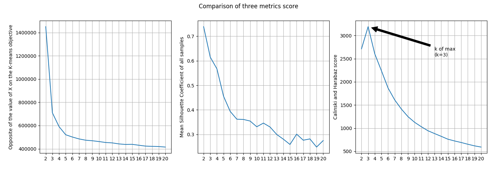
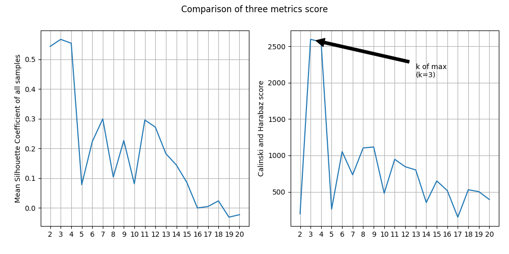

# Sales Transactions

## Dataset

[Sales_Transactions_Dataset_Weekly](http://archive.ics.uci.edu/ml/datasets/sales_transactions_dataset_weekly)

### Data Set Information

52 columns for 52 weeks; normalised values of provided too.

### Abstract

-|-
-|-
Data Set Characteristics |Multivariate, Time-Series
Attribute Characteristics|Integer, Real
Number of Attributes     |53
Number of Instances      |811
Associated Tasks         |Clustering

### Source

James Tan, jamestansc '@' suss.edu.sg, Singapore University of Social Sciences

## Result

PS. Best k identify by the maximum of Calinski and Harabaz score

Model               |Best K|Calinski and Harabaz score|Mean Silhouette Coefficient|Build in score
--------------------|------|--------------------------|---------------------------|--------------
K-Means Scikit Learn|3     |3191.7559                 |0.6147                     |-709316.5594
K-Means From Scratch|3     |2595.1019                 |0.5667                     |-

### K-Means Scikit Learn

### K-Means From Scratch

