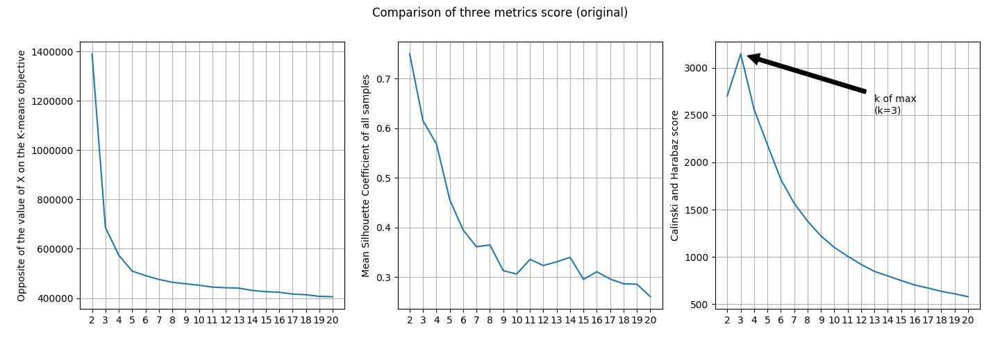
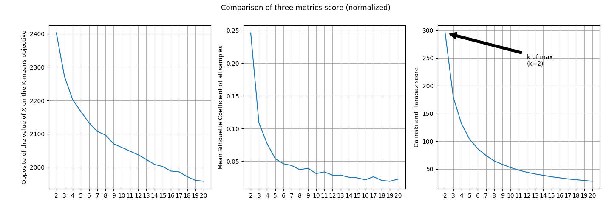
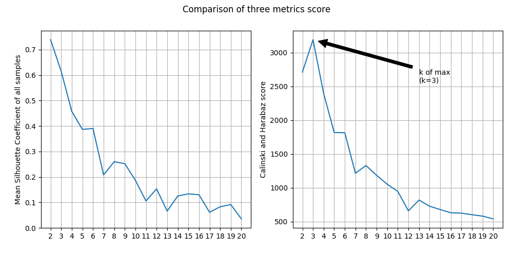

# Sales Transactions

## Dataset

[Sales_Transactions_Dataset_Weekly](http://archive.ics.uci.edu/ml/datasets/sales_transactions_dataset_weekly)

### Data Set Information

52 columns for 52 weeks; normalised values of provided too.

### Abstract

-|-
-|-
Data Set Characteristics |Multivariate, Time-Series
Attribute Characteristics|Integer, Real
Number of Attributes     |53
Number of Instances      |811
Associated Tasks         |Clustering

### Source

James Tan, jamestansc '@' suss.edu.sg, Singapore University of Social Sciences

## Result

Paper - [Finding Similar Time Series in Sales Transaction Data](https://link.springer.com/chapter/10.1007/978-3-319-19066-2_62)

PS. Best k identify by the maximum of Calinski and Harabaz score

Model                            |Best K|Calinski and Harabaz score|Mean Silhouette Coefficient|Build in score
---------------------------------|------|--------------------------|---------------------------|--------------
K-Means Scikit Learn (original)  |3     |2704.5317                 |0.7503                     |-686537.2554
K-Means Scikit Learn (normalized)|2     |295.0516                  |0.2464                     |-2402.6697
K-Means From Scratch (all data)  |3     |3191.7559                 |0.6147                     |-

### K-Means Scikit Learn

#### Original data

#### Normalized data

### K-Means From Scratch

#### All data

